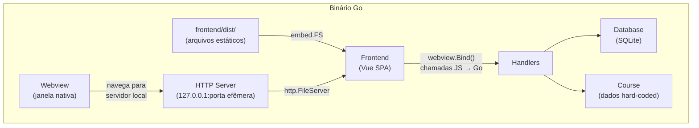

# GoTrack

[](https://go.dev/)
[](https://vuejs.org/)
[](https://www.sqlite.org/)
[](https://creativecommons.org/licenses/by-nc-sa/4.0/)
[]()

Painel de aprendizado desktop para acompanhar seu progresso no curso **[Aprenda Go](https://youtube.com/playlist?list=PLCKpcjBB_VlBsxJ9IseNxFllf-UFEXOdg)** do YouTube. Construído em Go + Vue.js + SQLite.

<!-- Adicione aqui um screenshot ou GIF da aplicação -->
<!--  -->

## Visão geral

Feito para devs que estão aprendendo ou migrando para a linguagem Go. O curso **Aprenda Go** foi criado por **[Ellen Korbes](https://ellenkorbes.com/)** — Google Developer Expert em Go, CNCF Ambassador e responsável pelo curso mais completo de Go em português. O curso era originalmente pago, mas hoje está disponível gratuitamente no YouTube.


#### Estrutura do curso

| Módulo | Capítulos | Descrição |
| --- | --- | --- |
| **Iniciante** | 1-7 | Visão geral, variáveis, tipos, fundamentos, fluxo de controle + exercícios |
| **Intermediário** | 8-17 | Arrays, slices, maps, structs, funções, ponteiros, aplicações + exercícios |
| **Avançado** | 18, 20, 21 | Concorrência, goroutines, canais + exercícios |
| **Ecossistema** | 19 | Terminal, workspace, IDEs, GitHub, compilação cruzada, pacotes |

**Total:** 21 capítulos, ~150 aulas

O GoTrack transforma essa experiência em um painel organizado: você acompanha seu progresso por capítulo, assiste aos vídeos direto na aplicação, desbloqueia exercícios conforme avança e usa um timer Pomodoro para manter o foco nos estudos.

Construído em Go com webview para a interface gráfica e SQLite para persistência local.

## Requisitos

- **Go** >= 1.21
- **Node.js** >= 18 (para build do frontend)
- **Dependências do webview** (bibliotecas de sistema)

### Dependências de sistema para o webview

O pacote `webview/webview_go` requer bibliotecas nativas do sistema operacional:

**Linux (Debian/Ubuntu):**
```bash
sudo apt install libgtk-3-dev libwebkit2gtk-4.0-dev
```

**Linux (Arch/Manjaro):**
```bash
sudo pacman -S gtk3 webkit2gtk
```

**macOS:**
Nenhuma dependência extra (usa WebKit nativo).

**Windows:**
Nenhuma dependência extra (usa WebView2/Edge).

## Instalação e execução

```bash
# 1. Clonar o repositório
git clone <url-do-repositorio>
cd gotrack-youtube

# 2. Build do frontend
cd frontend
npm install
npm run build
cd ..

# 3. Compilar e executar
go build -o gotrack
./gotrack
```

A aplicação abre uma janela de 1280x800 com a interface do GoTrack.

## Estrutura do projeto

```
gotrack-youtube-refactor/
├── main.go                         # Ponto de entrada da aplicação
├── go.mod                          # Módulo Go e dependências
├── go.sum                          # Checksums das dependências
├── internal/
│   ├── models/
│   │   └── models.go               # Structs de dados (Lesson, Chapter, Module, Stats)
│   ├── database/
│   │   ├── database.go             # Conexão, migrações e schema SQLite
│   │   └── queries.go              # Operações de banco (CRUD, estatísticas)
│   ├── handlers/
│   │   └── handlers.go             # Bindings JS <-> Go para o webview
│   └── course/
│       └── course.go               # Conteúdo do curso (capítulos, aulas, IDs YouTube)
└── frontend/                       # SPA Vue.js (ver frontend/README.md)
    ├── src/                        # Código-fonte Vue
    └── dist/                       # Build de produção (embarcado no binário)
```

## Arquitetura

### Como a aplicação funciona



1. O `main.go` inicializa o banco, popula os dados do curso, embarca os arquivos do frontend e inicia um servidor HTTP local
2. Uma janela webview é criada e navega até o endereço do servidor local
3. Funções Go são expostas ao JavaScript via `webview.Bind()`, permitindo que o frontend chame o backend diretamente
4. O frontend Vue.js se comunica com o backend exclusivamente por essas funções injetadas no `window`

### Sem servidor externo

A aplicação é completamente local. O servidor HTTP existe apenas para servir os arquivos estáticos ao webview — nenhuma porta é exposta externamente (`127.0.0.1` apenas) e a porta é efêmera (escolhida automaticamente pelo SO).

## Dependências Go

| Pacote | Função |
| --- | --- |
| `github.com/webview/webview_go` | Janela nativa com motor de renderização web (GTK+WebKit no Linux, WebView2 no Windows, WebKit no macOS) |
| `modernc.org/sqlite` | Driver SQLite puro em Go (sem CGo, sem dependência de libsqlite3) |

O uso de `modernc.org/sqlite` em vez de `mattn/go-sqlite3` elimina a necessidade de um compilador C e permite compilação simples.

## Armazenamento de dados

Todos os dados são locais. Nenhuma informação é enviada para servidores externos.

- **Banco:** `~/.config/gotrack/gotrack.db`
- **Formato:** SQLite 3
- **Backup:** Basta copiar o arquivo `.db`
- **Reset:** Deletar o arquivo `.db` reinicia todo o progresso

---

Este projeto está licenciado sob a
[Creative Commons Attribution-NonCommercial-ShareAlike 4.0 International License.](https://creativecommons.org/licenses/by-nc-sa/4.0/)
[](https://creativecommons.org/licenses/by-nc-sa/4.0/)
